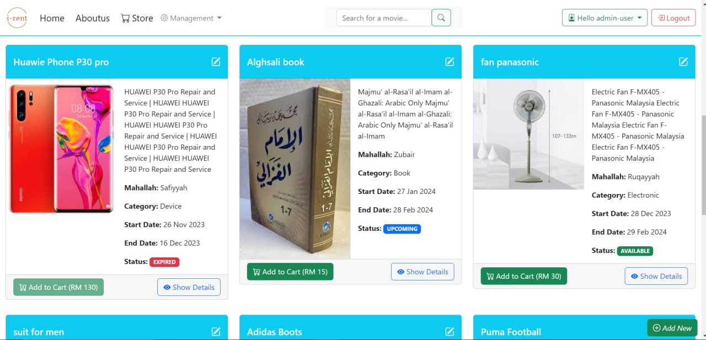
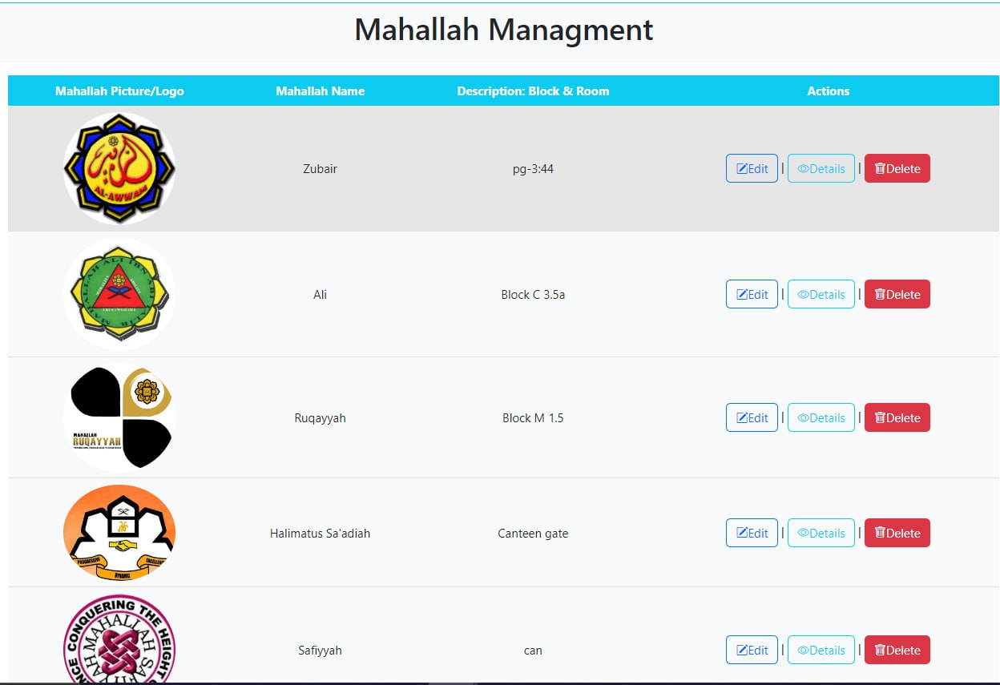

 # Final Year Project

*PROJECT TITLE:*

Creating a Sustainable and Economical Solution for Students: 
A Second-hand Rental Marketplace
 
 
STUDENT(S)
1.     MURAD MOHAMMED AL-ALWANI (1725083)
2.     MOHAMMAD AYYUB AZIZULLAH (1915021)

- Description:

I-Rent is an innovative online platform designed to facilitate safe and convenient student-to-student renting through social media channels. Recognizing the financial constraints students face, this project aims to build a trusted rental community by implementing features such as a robust rating and review system, user verification processes, and secure payment methods. Emphasizing safety, the platform incorporates secure user identification to mitigate fraudulent activities. The project also focuses on enhancing user experience through immediate access to needed items and a user-friendly interface. By addressing concerns related to trust, safety, and communication, the Student Rental Hub promotes sustainable consumption and fosters a sense of community among students. The project is open-source and aims to contribute to the development of a secure and seamless renting experience for students.

- Methodology:

Several factors influence the selection of the development strategy, including project complexity, requirements, budget, timeframe, and the development team's skills. In the case of i-Rent, an Agile development approach has been adopted. Agile encompasses frameworks that aid in structuring, designing, and governing the system during its construction, aligning well with the development phases of i-Rent.

- Web Development Framework: ASP.NET

ASP.NET serves as the primary web development framework for i-Rent. This framework, developed by Microsoft, is widely recognized for its scalability, security features, and ease of integration with other Microsoft technologies. 

- Programming Language: C#

The i-Rent project utilizes the C# programming language, known for its versatility and suitability for web application development. C# provides a robust and type-safe programming environment, contributing to the overall efficiency and reliability of the system.

- Database Management System: Microsoft Server

For the backend database management, Microsoft Server has been chosen as the foundation. Its robust capabilities in handling data, ensuring data integrity, and scalability align well with the project's requirements. Microsoft Server offers a secure and efficient platform for storing and retrieving data critical to the functioning of the i-Rent platform.

- Frontend Design: Bootstrap

The frontend of the i-Rent web application is designed using Bootstrap. Bootstrap is a powerful and responsive front-end framework that facilitates the creation of visually appealing and user-friendly interfaces. By leveraging Bootstrap, the i-Rent platform ensures a seamless and consistent user experience across various devices.

- Here are some outputs from the website::

- 

